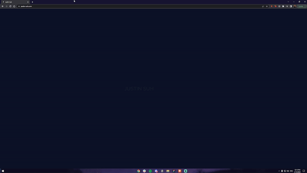
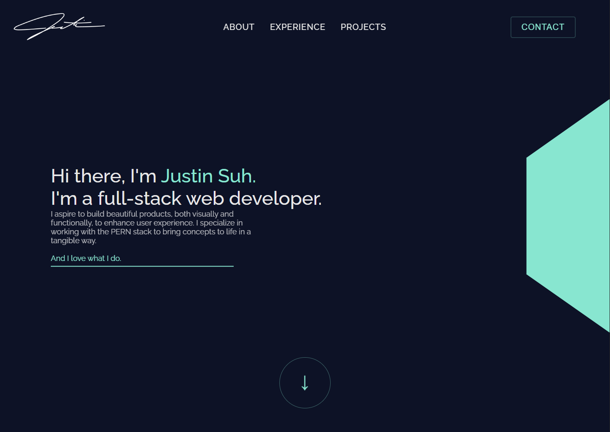
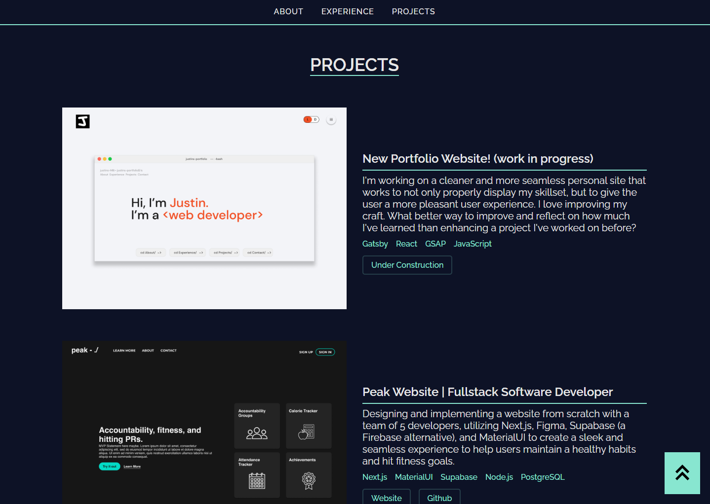
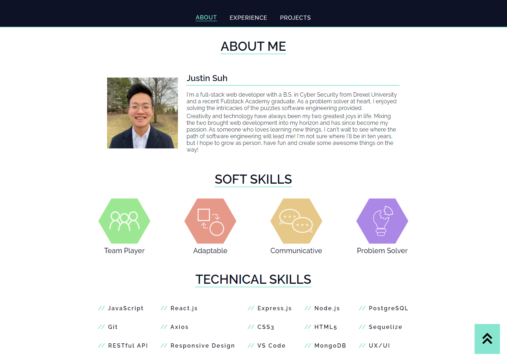

# Justin Suh 

[Purpose](#purpose) •
[Demo](#demo) •
[Tech Stack](#tech-stack) •
[Packages](#packages) •
[Lessons Learned](#lessons-learned)

## Purpose

- This website is my personal portfolio where I can not only demonstrate my skillset, but also talk about my experiences and past projects that have brought me to where I am now.
- I think there's a beauty in not just making a portfolio, but projects in general. Each project I make is a step towards my goal of learning more about the constantly expanding field of web development and software engineering. 

## Demo

    

## Screenshots

<h3 align="center">Landing Page<h3>

    

<h3 align="center">Projects<h3>

    

<h3 align="center">About<h3>

    

## Tech Stack

| Tech Name  | Home Page               |
| ---------- | ----------------------- |
| React      | <https://reactjs.org/>  |
| create-react-app (toolchain)  | <https://reactjs.org/docs/create-a-new-react-app.html/> |

## Packages

| Package Name      | Home Page                        |
| ----------------- | -------------------------------- |
| Aos               | <http://michalsnik.github.io/aos/>            |

## Lessons Learned

Creating a personal website was one of the goals I always wanted to accomplish, but never thought I'd achieve. Even when I wasn't in web development, I wanted to create a personal portfolio filled with creative ideas. I will say that my creativity was heavily limited by my knowledge of libraries and stuck mainly with the classic JavaScript, CSS and HTML. But this was only more motivation for me to get even better at these tools and add more to my skillset so I can make something that I can satisfy my creative side. But anyway, onto the tech!

Probably noticed, but I hardly used anything other than the bare bones for web development. This brought some challenges that required me to dive deeper into these tools than I had ever done before. I don't regret sticking to the fundamentals. I think that this provided me a great opportunity to get my foundation even more concrete than it was before.

